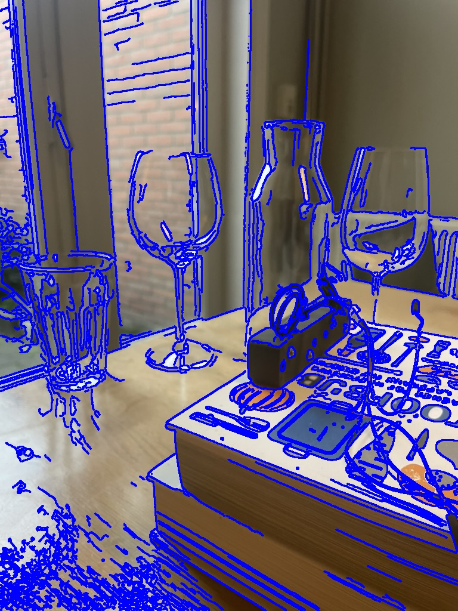
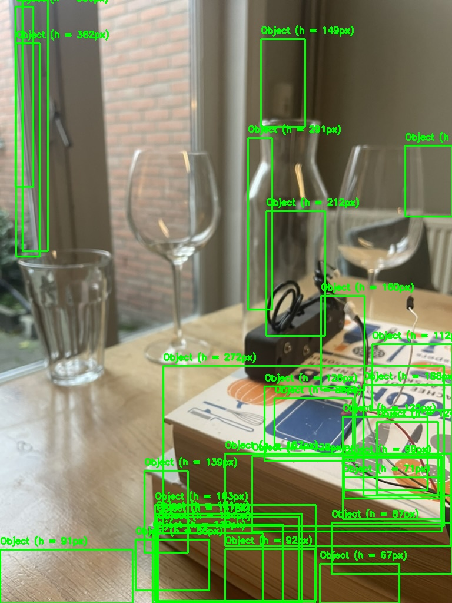

# Object Detection and Contour Analysis

This repository contains a Python script that uses OpenCV to detect and label objects in an image based on contours and bounding boxes. The script processes the image step-by-step, and saves intermediate and final results for better debugging and visualization.

---

## Features

1. **Preprocessing**:
   - Converts the image to grayscale.
   - Applies Gaussian blurring to reduce noise.

2. **Edge Detection**:
   - Uses the Canny edge detection algorithm.

3. **Contour Detection**:
   - Identifies and draws contours on the image.

4. **Bounding Box Filtering**:
   - Filters out small noise using a minimum area threshold.
   - Labels detected objects with their heights in pixels.

5. **Save Outputs**:
   - Saves the following images for review:
     - Edges
     - Contours
     - Final detected objects

---

## Prerequisites

Ensure the following are installed:

- Python 3.x
- OpenCV library (`pip install opencv-python`)
- NumPy library (`pip install numpy`)

---

## How to Use

1. Place the input image in the same directory as the script. Rename it to `glazen.jpeg` (or update the path in the script).
2. Run the script using:

   ```bash
   python object_detection.py
   ```

3. Check the saved output images in the same directory:
   - `edges_output.jpg`
   - `contours_output.jpg`
   - `detected_objects_output.jpg`

---

## Output Explanation

### 1. Edges Output

This image shows the detected edges using the Canny edge detection algorithm.


### 2. Contours Output

This image visualizes all detected contours drawn over the input image.



### 3. Detected Objects

The final output highlights objects detected based on size, enclosed in green bounding boxes with height labels.



---

## Customization

- **Canny Thresholds**:
  Modify the thresholds for edge detection in the script:
  ```python
  edges = cv2.Canny(blurred, 20, 50)
  ```

- **Minimum Area Threshold**:
  Adjust the `w * h > 9000` condition to detect smaller or larger objects.

---

## Example Command

```bash
python object_detection.py
```

---

## Results

### Input Image
Provide your input image, e.g., `glazen.jpeg`.

### Outputs
- `edges_output.jpg`
- `contours_output.jpg`
- `detected_objects_output.jpg`

These outputs will be saved automatically after running the script.
