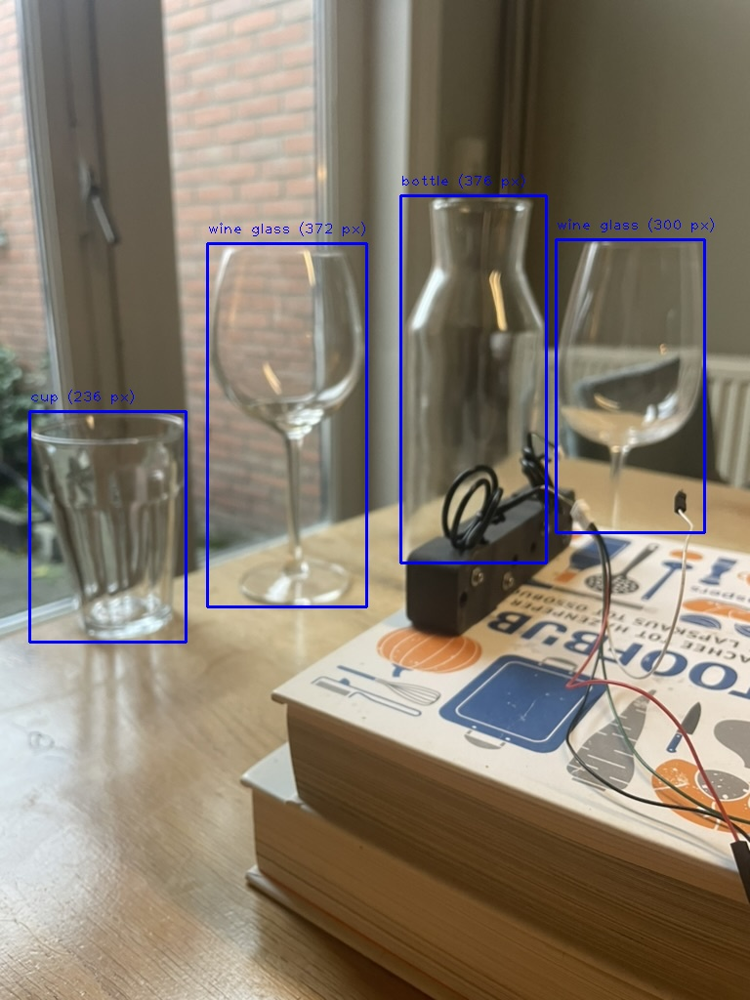

# Object Detection: Contour-Based vs. YOLO Model

This project demonstrates two approaches for object detection in images: a traditional contour-based method and a deep-learning-based YOLO model. Both methods are applied to the same image (`glazen.jpeg`) for comparison.

---

## Methods Overview

### 1. **Contour-Based Detection**
This method leverages OpenCV's image processing capabilities to detect objects based on edges and contours.

**Steps:**
- Convert the image to grayscale.
- Apply Gaussian blurring to reduce noise.
- Use the Canny edge detection algorithm to find edges.
- Detect contours and filter them by size.
- Draw bounding boxes and label objects with their heights in pixels.

**Pros:**
- Simple and lightweight.
- No need for pre-trained models or large dependencies.

**Cons:**
- Cannot classify objects.
- Sensitive to noise and lighting conditions.

**Output:**
- Saved as `glazen_contour.jpeg`.

### 2. **YOLO Model Detection**
This method uses the YOLO (You Only Look Once) object detection model to detect and classify objects.

**Steps:**
- Load a pre-trained YOLO model (`yolo11x.pt`).
- Perform inference to detect objects in the image.
- Draw bounding boxes and label objects with their class names and heights in pixels.

**Pros:**
- Highly accurate and robust.
- Capable of object classification.

**Cons:**
- Requires pre-trained weights.
- Computationally heavier compared to contour-based methods.

**Output:**
- Saved as `glazen_yolo.jpeg`.

---

## How to Run

### Prerequisites
- Python 3.x
- Required Libraries:
  ```bash
  pip install opencv-python numpy matplotlib ultralytics
  ```

### Steps

1. Place the input image (`glazen.jpeg`) in the working directory.

2. **Run the Contour-Based Script:**
   ```bash
   python contour_detection.py
   ```
   This generates the output image `glazen_contour.jpg`.

3. **Run the YOLO-Based Script:**
   ```bash
   python yolo_detection.py
   ```
   This generates the output image `glazen_yolo.jpeg`.

---

## Results and Comparison

### Contour-Based Detection
- **Strengths:**
  - Lightweight and fast for basic object localization.
- **Weaknesses:**
  - Cannot classify objects or handle complex scenes.

### YOLO Detection
- **Strengths:**
  - Precise object detection with classification.
  - Handles complex scenes effectively.
- **Weaknesses:**
  - Requires more computational resources.

### Visual Comparison
Run the comparison script to view the outputs side by side:

**Contour-Based Detection Output:**


**YOLO Detection Output:**


---

## Customization

### Contour-Based Method
- Adjust the Canny edge detection thresholds:
  ```python
  edges = cv2.Canny(blurred, 20, 50)
  ```
- Modify the minimum contour area to filter noise:
  ```python
  if w * h > 9000:
  ```

### YOLO Model
- Update the YOLO model weights by replacing `yolo11x.pt` with your desired model.
- Adjust the confidence threshold:
  ```python
  conf=0.5
  ```
- Specify classes to detect using the `classes` parameter.

---

## Conclusion
This project highlights the trade-offs between traditional and deep-learning-based methods for object detection. Choose the method based on your requirements for accuracy, speed, and classification capabilities.
